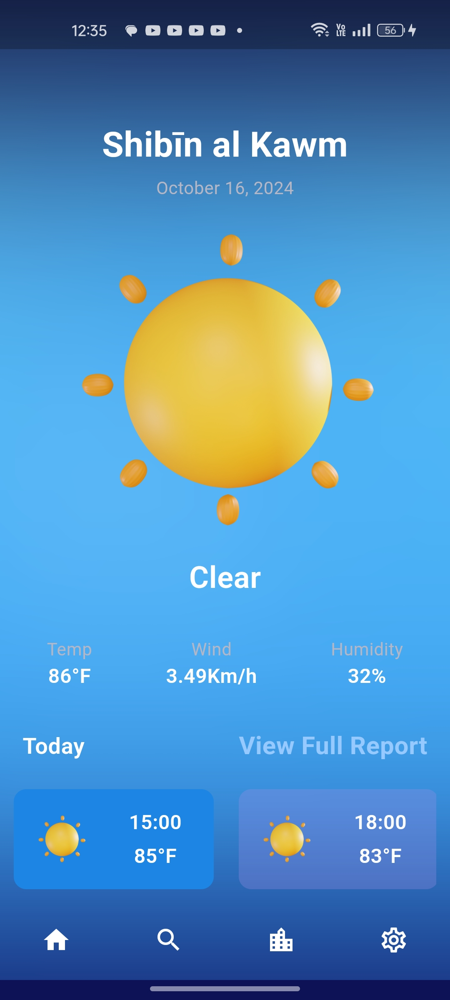
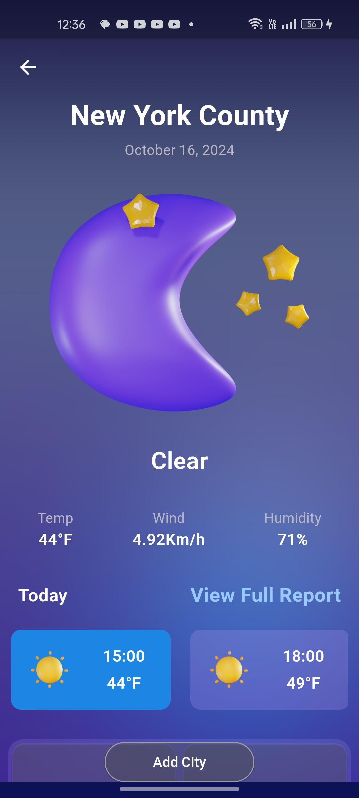

# 🌤️ Weather App

A feature-rich weather application that provides real-time weather information and forecasts. The app focuses on user experience, offering a beautiful interface with adaptive backgrounds and smooth animations.

## Features

1. **🌍 Current Location Weather**: Automatically fetches weather information based on the user's current location.
2. **🔒 Location Permissions Management**: Respects user preferences regarding location access and provides a seamless experience, even if location services are turned off.
3. **🔔 Push Notifications**: Sends notifications to keep users informed about weather updates, even when the app is closed.
4. **🔍 City Search with Suggestions**: Allows users to search for cities with a smart suggestion system to enhance the search experience.
5. **⭐ Favorite Cities**: Users can add cities to their favorites, which are stored in local storage for quick access.
6. **🌡️ Temperature Units**: Displays weather information in both Fahrenheit and Celsius, allowing users to choose their preferred unit.
7. **📊 Detailed Weather Information**: Presents comprehensive weather details, including temperature, pressure, humidity, wind direction, visibility, and more.
8. **📅 5-Day Forecast**: Provides a forecast for the next 5 days, with updates every 3 hours for both current locations and searched cities.
9. **✨ Beautiful Animations**: Features smooth animations that enhance the user experience and make the app visually appealing.
10. **🌈 Adaptive Backgrounds**: Changes the background according to the time of day (day/night) based on the current location and the searched city.

## Screenshots


*screenshot of homescreen*


*screenshot of the search screen*


*screenshot of the searched city screen*

## Installation

1. Clone the repository:
   ```bash
   git clone https://github.com/yourusername/weather-app.git
